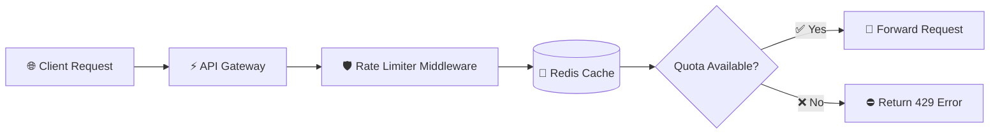

<div align="center">

# 🚀 DISTRIBUTED RATE LIMITING SYSTEM

### ⚡ High-Performance Distributed API Protection Microservice

<p align="center">
  
  
  
  
  
</p>

</div>

---

# 📌 Overview

A **high-performance distributed rate-limiting microservice** engineered to protect backend APIs from:

- 🚫 Traffic Spikes  
- 🔒 Brute Force Attacks  
- ⚠️ DDoS Attempts  

Built using a **polyglot microservices architecture** powered by:

- 🐍 **Python (FastAPI)**
- ☕ **Java**
- ⚡ **Redis**
- 🐳 **Docker**

The system ensures:

✅ High Availability  
✅ Thread-Safe Request Throttling  
✅ Distributed State Synchronization  
✅ Ultra-Low Latency Enforcement  

---

# ✨ Core Features

## ⚡ Distributed State Management
Utilizes **Redis** as a centralized in-memory datastore to enforce strict rate limits across distributed service instances without race conditions.

---

## 🧠 Pluggable Algorithms
Supports industry-standard rate-limiting algorithms:

- 🪣 Token Bucket
- 🕒 Sliding Window Log
- 📊 Fixed Window Counter

---

## 🚀 Ultra Low Latency
Optimized middleware pipeline ensures rate-limit validation adds:

```text
< 10ms overhead per request
```

---

## 🐳 Fully Containerized
Complete Dockerized infrastructure using:

- Docker
- Docker Compose

Enables reproducible local development and scalable deployment.

---

## 🛡️ Fault Tolerance
Designed for resilience during high-load scenarios while protecting backend services from overload conditions.

---

# 🏗️ Architecture Workflow



---

# 🔄 Request Lifecycle

## 1️⃣ Client Request
Incoming API requests hit the API Gateway.

## 2️⃣ Middleware Interception
The Rate Limiter intercepts requests immediately.

## 3️⃣ Redis Validation
The middleware checks:

- Client IP
- API Key
- Current request quota

against the Redis distributed cache.

## 4️⃣ Decision Engine

### ✅ Quota Available
- Request forwarded to backend services
- Rate-limit headers attached

### ❌ Quota Exceeded
Returns:

```http
429 Too Many Requests
```

with:

```http
Retry-After: <seconds>
```

---

# 💻 Tech Stack

| Layer | Technology |
|---|---|
| API Gateway | FastAPI |
| Business Logic | Java |
| Distributed Cache | Redis |
| Containerization | Docker |
| Orchestration | Docker Compose |

---

# 🚀 Local Development Setup

## 📋 Prerequisites

Install the following:

- 🐳 Docker Desktop
- 🔧 Git

---

# ⚙️ Installation Guide

## 1️⃣ Clone Repository

```bash
git clone https://github.com/Priyasha1503/DISTRIBUTED_RATE_LIMITING_SYSTEM.git

cd DISTRIBUTED_RATE_LIMITING_SYSTEM
```

---

## 2️⃣ Configure Environment Variables

Create a `.env` file:

```env
REDIS_HOST=redis
REDIS_PORT=6379
RATE_LIMIT_MAX_REQUESTS=100
RATE_LIMIT_WINDOW_SECONDS=60
ALGORITHM=TOKEN_BUCKET
```

---

## 3️⃣ Build & Run Services

```bash
docker-compose up --build -d
```

---

## ✅ Service Status

API will run at:

```text
http://localhost:8000
```

---

# 🧪 Rate Limiter Testing

Trigger throttling using:

```bash
for i in {1..110}; do
  curl -i http://localhost:8000/api/v1/resource
done
```

Expected Result:

```http
429 Too Many Requests
```

---

# 🔌 API Documentation

## 📍 Resource Access Endpoint

### Endpoint

```http
GET /api/v1/resource
```

---

## ✅ Success Response

```http
200 OK
```

### Response Headers

```http
X-RateLimit-Limit
X-RateLimit-Remaining
```

---

## ❌ Rate Limit Exceeded

```http
429 Too Many Requests
```

### Response Headers

```http
Retry-After
```

---

# 🔮 Future Enhancements

## 📊 Observability
- Prometheus Integration
- Grafana Dashboards
- Real-Time Monitoring

---

## 🧠 Dynamic Tiering
Different rate limits based on:

- Free Users
- Premium APIs
- Enterprise Clients

---

## 🚫 Intelligent IP Blacklisting
Automated blocking of malicious clients consistently violating thresholds.

---

# 📸 System Goals

✅ Scalability  
✅ High Availability  
✅ Low Latency  
✅ Distributed Consistency  
✅ Production-Grade Architecture  

---

<div align="center">

# 👨‍💻 Developed By

### Priyasha Sabbavarapu

💼 LinkedIn:  
https://www.linkedin.com/in/priyasha1503/


⭐ If you like this project, give it a star on GitHub!

</div>
